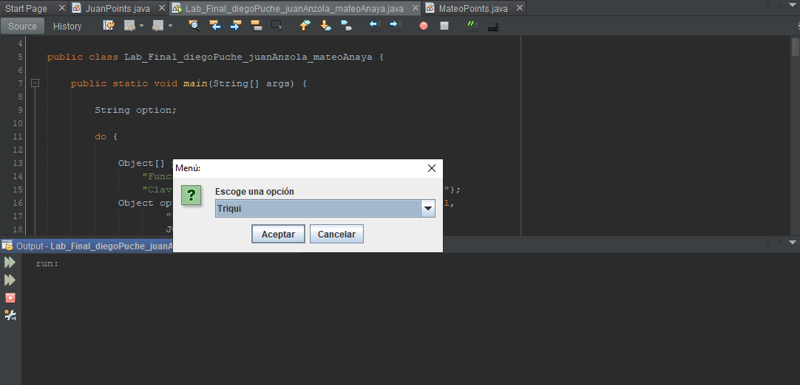
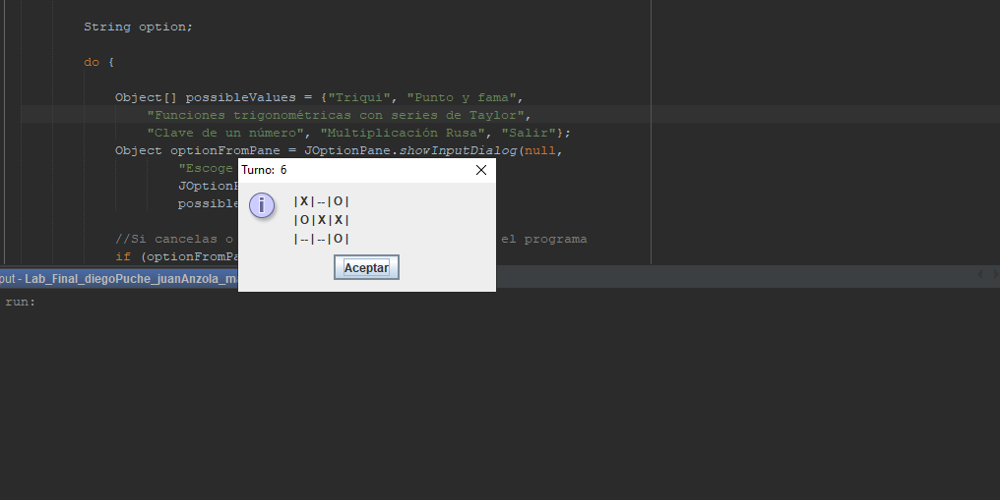
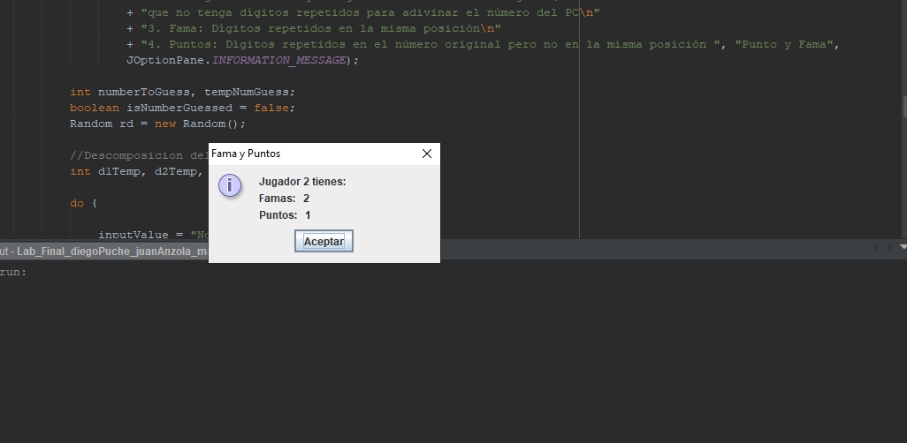

# Laboratorio Final de Sistemas
> Laboratorio 2, de la materia de algoritmia y programación 1, dictada por Rocio Ramos Rodrigez.

En el laboratorio encontraremos 5 programas:

* Triqui
* Punto y fama
* Series de Taylor, Seno y Coseno
* Clave de un número
* Multiplicacion rusa

El funcionamiento de los programas se explica a continuación.

## Triqui

1. Mostrar las instrucciones del juego al usuario
2. Permitir escoger una pocision en el tablero y verificar si la casilla esta vacia
3. Verificar si un jugador gano
4. Renderizar el tablero en un JOptionPane

## Punto y Fama

1. Mostrar las instrucciones del juego al usuario
2. Generar un numero de 4 cifras por el PC y validar digitos repetidos
3. Permitir al jugador ingresar numeros de 4 cifras sin digitos repetidos
4. Procesar los puntos y famas del numero
5. Mostrar los puntos y famas usando JOptionPane
6. El programa acaba hasta que el jugador adivine el número.

## Series de Taylor

1. Se pregunta por ángulo en grados
2. Se procesa la serie hasta 10 iteraciones
3. Se realizan los calculos en cada iteracion, del factorial, potencia y signo de cada termino
de las dos series
4. Se muestran los resultados del seno, coseno, tangente, secante, cosecante y cotangente.

## Clave de un número

1. Se digita un numero positivo, los negativos tienen clave 1
2. Se usa un while para iterar sobre los digitos del número
3. por cada iteracion se realiza el proceso de indicado (d1 * 2) + (d2 * 3) ..
donde d, representa los digitos...
4. Se muestran los resultados

## Multiplicación rusa

1. Se digita el multiplicador, un número natural
2. Se digita el multiplicando, un número natural
3. Se procesan usando un while que se ejecuta hasta que el multiplicador sea 1
4. El resultado se almacena una variable acumuladora
5. Se muestran los resultados 

